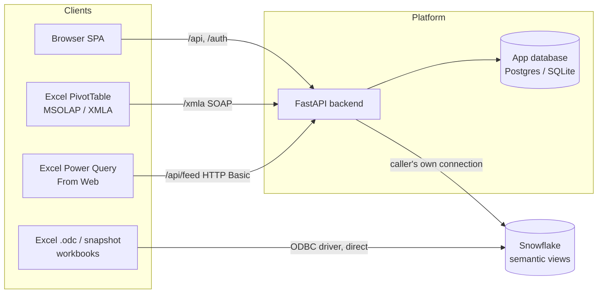
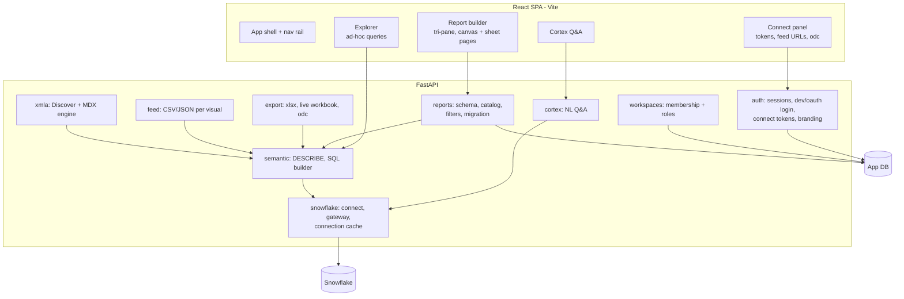

# High-Level Architecture

A PowerBI-style enterprise reporting platform over **Snowflake semantic
views**. Users build reports, explore data, ask questions in natural
language, and connect Excel — and every query, on every path, runs on the
**caller's own Snowflake connection**. The platform never holds a shared
service account for data access.

## System context

Four ways into the data, one identity model:

| Path | Client needs | Auth | Runs on |
| --- | --- | --- | --- |
| Browser app | nothing | session cookie | the session's Snowflake connection |
| Excel PivotTable (Analysis Services) | stock Excel | connect token | the same session's connection |
| Excel Power Query (From Web) | stock Excel | connect token | the same session's connection |
| .odc / live workbook | Snowflake ODBC driver | user signs into Snowflake | the user's own driver connection |

## Core principles

1. **The caller's own connection.** Signing in (password, key pair, or
   OAuth) opens a Snowflake connection that is cached per app session.
   Every describe, query, export, feed row and MDX cell is produced on
   that connection — Snowflake's own RBAC is always the last word.
2. **The workspace decides visibility.** Being able to log into Snowflake
   is not being allowed to read a colleague's report definition. Reports
   live in workspaces; non-members get 404 (not 403 — the feed and API
   must not reveal what exists), members below the needed role get 403.
3. **Values are bound, never SQL text.** Filter values, slicer picks, feed
   URL parameters and MDX member keys all reach Snowflake as bound
   parameters. Field references are validated against a live DESCRIBE of
   the semantic view before any SQL is built.
4. **Documents carry no identity.** Exported workbooks, .odc files and
   report definitions contain no credentials and no tokens.
5. **Branding is deployment config.** `SEMANTICUI_APP_NAME` and a logo
   (URL or local file) rebrand the shell, login, browser tab, XMLA
   catalog and auth realms without a rebuild.

## Components

### The app database holds control-plane state only

Users, sessions (with encrypted OAuth tokens and hashed connect tokens),
workspaces and memberships, report definitions (a versioned JSON document),
saved explores. **No query results, no cached data rows** — data lives in
Snowflake and is fetched fresh on the caller's connection.

### The semantic layer is the one query path

Everything that reads data funnels through the same two steps:

1. `DESCRIBE SEMANTIC VIEW` (cached per session, short TTL) — the source of
   truth for which tables, dimensions, metrics and facts exist.
2. `build_semantic_sql(detail, request)` — turns a validated request
   (dimensions, metrics, filters, order, limit) into one SQL statement with
   bound parameters.

Report tiles, the explorer, exports, the Power Query feed and the XMLA MDX
engine are all thin adapters over this path, which is why a matrix in the
app, a CSV in Power Query and a pivot cell in Excel can never disagree.

## Excel connectivity strategy

Three tiers, by what the client machine allows:

- **Zero install, full pivot: XMLA.** The backend impersonates a SQL Server
  Analysis Services server well enough that stock Excel's MSOLAP provider
  connects (`Data → Get Data → From Analysis Services`). Entities become
  dimensions, fields become attribute hierarchies, metrics become measures.
  Drag, drill, collapse, slice and filter all work; every MDX statement is
  translated to semantic-view SQL live.
- **Zero install, flat table: Power Query feed.** Per-visual CSV/JSON URLs
  (`/api/feed/...`) refreshed with `Data → Refresh All`; URL parameters
  (`?f.TABLE.FIELD=value`) allow worksheet-cell-driven slicing.
- **Driver installed: direct.** One-click .odc files and exported live
  workbooks connect Excel straight to Snowflake through the ODBC driver.

Excel-side credentials are **connect tokens**: minted by the signed-in app
UI, shown once, stored only as a hash, at most 24 h, revoked by sign-out or
re-minting. Excel never sees a Snowflake password.

## Deployment shape

- `dev.py` runs both halves in development: Vite on 5173 proxying `/api`,
  `/auth` and `/xmla` to a uvicorn backend on a per-run port.
- Schema is managed by Alembic (`alembic upgrade head` on bootstrap).
- The backend is stateless apart from the in-process Snowflake connection
  cache: a restart signs everyone out of data access until they log in
  again (dev/key-pair connections are not rebuildable; OAuth ones are).
- TLS termination, hostnames and reverse proxying are the deployment's
  business; every client path is plain HTTP behind whatever terminates it.

## Where to go deeper

`low-level.md` in this directory walks each backend package, the frontend
module map, the database schema, the XMLA protocol contract and the request
flows in detail.
