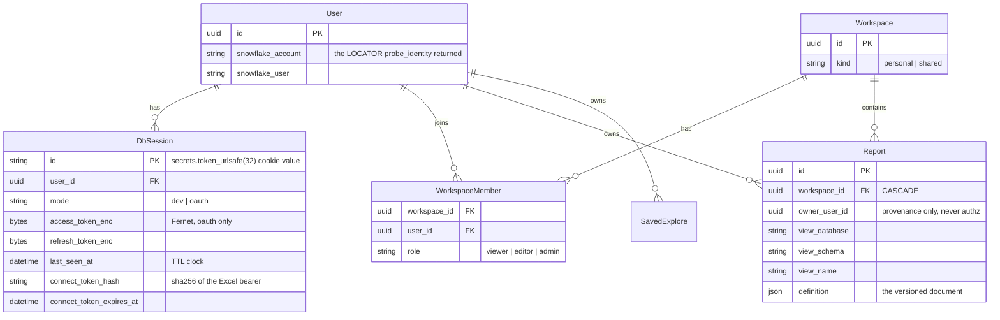

# Low-Level Architecture

Companion to `high-level.md`. This walks the code: packages, key types,
request flows, the database schema, and the XMLA protocol contract.

## Backend package map (`backend/app/`)

| Package | Responsibility | Key modules |
| --- | --- | --- |
| `auth` | Sign-in, sessions, connect tokens, crypto | `routes.py` (login/me/logout, `current_session`), `dev.py` (dev-login: password/key-pair), `oauth.py`, `sessions.py` (DB-backed sessions, TTL, cookie), `connect_token.py` (mint/resolve Excel bearer), `crypto.py` (Fernet for OAuth tokens) |
| `snowflake` | Connections and query execution | `connect.py` (connect_dev/connect_oauth, `probe_identity`), `gateway.py` (`run_query` — bound params, row caps, `QueryResult`), `provider.py` (`ConnectionCache`: per-session entries with lock + describe cache, idle sweep, OAuth rebuild) |
| `semantic` | The one query path | `discovery.py` (`list_semantic_views`, `describe_semantic_view`), `query.py` (`SemanticQueryRequest`, `build_semantic_sql`), `predicates.py` (`resolve_field`, filter ops → SQL + params), `joins.py` |
| `workspaces` | Membership and roles | `access.py` (`require_access(db, user_id, report_id, need)` — 404 non-member, 403 low role), `service.py` (`ensure_personal_workspace`) |
| `reports` | The report document | `schema.py` (pydantic document model + `parse_definition` validation), `catalog.py` (visual types, wells, `wells_to_query`), `filters.py` (filter model, `is_active`), `migrate.py` (v1→v3 document migration), `service.py`, `routes.py` |
| `explores` | Saved ad-hoc explorations | mirrors reports at smaller scale |
| `cortex` | Natural-language Q&A via Snowflake Cortex | `routes.py` |
| `export` | Excel artifacts | `sheets.py`/`workbook.py` (snapshot .xlsx), `live.py` (live-connection workbook: OOXML query table + hidden definedName), `odc.py`, `literals.py` (CSV formula-injection guard), `service.py`, `routes.py` (also `POST /api/connect/token`, `GET /api/branding`… branding itself lives in `main.py`) |
| `feed` | Power Query per-visual feed | `service.py` (`build_feed_request`, `run_feed`), `render.py` (`to_csv` RFC 4180 + formula guard, `to_json`), `routes.py` (Basic → connect token) |
| `xmla` | Excel Analysis Services adapter | `soap.py`, `rowset.py`, `discover.py`, `mdx.py`, `execute.py`, `dataset.py`, `state.py`, `routes.py` — detailed below |
| `db` | SQLAlchemy models + engine | `models.py`, `base.py` (`get_db`) |

`config.py` is pydantic-settings with prefix `SEMANTICUI_` reading `.env`
(auth mode, database URL, TTLs, row caps, Cortex model, branding
`app_name` / `app_logo_url` / `app_logo_file`).

## Database schema



Migrations are Alembic (`backend/migrations/versions/0001…0005`).
`owner_user_id` is provenance only — `require_access` decides everything.

### The report definition document (`schemaVersion: 3`)

```
{ schemaVersion, name, view{database,schema,name}, canvas{columns,rowHeight,background?},
  pages: [ { id, name, kind: "canvas"|"sheet", visuals: [
      { id, type, title, layout{x,y,w,h}, wells{...}, options{...}, filters[] } ],
      filters[] } ],
  filters[],            // report scope
  hierarchies: [ { id, name, levels[] } ] }
```

- Visual types and their wells are declared once in `reports/catalog.py`
  and mirrored by `frontend/src/reports/catalog.ts`; both are tested
  against the same expectations.
- Filter scopes compose by intersection: report ∧ page ∧ visual.
- A `sheet` page holds exactly one visual, of type `matrix` or `table`
  (schema-enforced) — the Excel-like full-page pivot.
- `migrate.py` upgrades v1 (top-level visuals) and v2 in place on read.
- Well refs are `"TABLE.FIELD"`; `"hierarchy:<id>"` expands to that
  hierarchy's levels for validation, and to its top level when queried
  fresh.

## Request flows

### Sign-in and the connection cache

```
POST /auth/dev-login {account,user,authenticator,password|key}   (or OAuth redirect flow)
 → sf_connect.connect_dev/oauth  → probe_identity(conn) = (ACCOUNT_LOCATOR, USER)
 → upsert User, ensure_personal_workspace, create DbSession row
 → get_cache().put(session.id, conn, rebuildable=oauth?)
 → Set-Cookie semanticui_session
```

Every API route: `Depends(current_session)` → `get_cache().acquire(db,
sess)` → `CacheEntry{conn, lock, describe_cache}`. Dev/key-pair entries
are the only copy of the credential — held until session expiry; OAuth
entries rebuild silently from the refresh token. Long queries are guarded
by taking `entry.lock`; the sweeper never evicts a locked entry.

### A visual's query

```
POST /api/query/semantic  {database,schema,view,dimensions,metrics,aggregations,filters,orderBy,limit}
 → resolve every field against describe_semantic_view (session-cached)
 → build_semantic_sql → (sql, params, limit)  — filters become placeholders
 → gateway.run_query(entry.conn, sql, params)  → {columns, rows, truncated, sfqid}
```

The frontend's `useVisualQuery` composes wells + the three filter scopes +
drill state + cross-filter + slicer selections into that request.

### Connect token life cycle

```
POST /api/connect/token (cookie auth) → raw "xlt_…" shown once
  DbSession.connect_token_hash = sha256(raw); expires min(24h, session TTL)
Excel Basic auth (any username, password = raw token)
 → connect_token.resolve(db, raw) → live DbSession (also touches last_seen)
 → get_cache().acquire(...) → the SAME connection the browser uses
Revocation: logout deletes the session; re-minting replaces the hash.
```

The feed (`/api/feed/reports/{r}/visuals/{v}.csv|.json`) and the XMLA
endpoint both authenticate exactly this way; neither can open a Snowflake
connection of its own.

## The XMLA adapter (`backend/app/xmla/`)

The adapter impersonates SQL Server Analysis Services closely enough for
stock Excel's MSOLAP 17 provider. Everything below was learned from wire
captures (see `docs/superpowers/manual-passes/2026-08-18-xmla-pivot.md`)
— MSOLAP's failure mode is a hang or a generic HRESULT, so the trace
(`SEMANTICUI_XMLA_TRACE=<file>`) and ADOMD.NET (which reports textual
errors for the same protocol) are the debugging tools.

### Module responsibilities

- `soap.py` — parse Discover/Execute envelopes (Session/BeginSession/
  EndSession headers), build response envelopes, SOAP faults (ErrorCode is
  **numeric** on the wire; clients parse it with a number parser).
- `state.py` — `SessionStore`: XMLA session id → app session id. Holds no
  connections; `acquire_entry` resolves through the connection cache per
  request. A token digest index lets pre-session Discovers share one XMLA
  session.
- `discover.py` — the catalog: one XMLA catalog (named by
  `SEMANTICUI_APP_NAME`), one cube per semantic view (`DB.SCHEMA.VIEW`),
  one dimension per entity, one two-level attribute hierarchy per field
  ((All) + leaf), one measure per metric, plus the `[Measures]` hierarchy
  and `MeasuresLevel` level. `MDSCHEMA_MEMBERS` serves real leaf values
  via `SELECT DISTINCT` (capped 1000) for Excel's filter dropdowns.
- `rowset.py` — the generic rowset serializer: one column list produces
  both the inline XSD and the rows (impossible to desynchronise); columns
  carry required-vs-optional and a `uuid` simpleType.
- `mdx.py` — tokenizer + recursive-descent parser for the MDX subset
  Excel emits: axes with `Hierarchize` / `AddCalculatedMembers` /
  `DrilldownLevel` / `DrilldownMember(base, drillSet, hierarchy)` /
  `CrossJoin` / literal sets / `.Members` / `.Children` / unary set
  complement `{-{m}}` (collapse); `WHERE` tuples; subselect `FROM (SELECT
  … )` filters; `CELL PROPERTIES`. Anything else raises `MdxUnsupported`
  with the construct named.
- `execute.py` — the engine: classifies each axis into hierarchy specs
  (measures / drills with optional per-parent constraints), runs one
  aggregate query per distinct grouping the axes need (grand total,
  per-parent subtotals, full cross), builds tuples in CrossJoin order with
  NON EMPTY pruning, and resolves each cell ordinal (Axis0-fastest) from
  the cached grouping tables. Member-list queries (no measure anywhere)
  run dimension-only and answer no cells.
- `dataset.py` — the mddataset response. The embedded XSD is byte-for-byte
  the schema Mondrian serves Excel (their integration fixtures are the one
  Excel-accepted reference). Member properties must be declared in the
  axis `HierarchyInfo` before members carry them; an empty slicer is an
  empty `<Tuples/>`.
- `routes.py` — `POST /xmla`: Basic (token) or Session header; the
  `X-Transport-Caps-Negotiation-Flags` header goes on **every** response
  (faults and 401s included); `X-AS-SessionID` accompanies in-session
  responses; the wire tap writes verbatim request/response pairs.

### Protocol rules that are load-bearing

1. `DISCOVER_SCHEMA_ROWSETS` advertises **full canonical restriction
   lists in canonical order** — MSOLAP translates OLE DB restriction
   ordinals to names using the order the server advertises.
2. A statement-less Execute answers the `urn:…:empty` root, never an
   empty mddataset.
3. `MDSCHEMA_PROPERTIES` `PROPERTY_TYPE=2` answers the cell-property
   list; member-property queries answer level-scoped rows only where
   custom properties exist (for attribute hierarchies: none).
4. Metadata rowset layouts mirror Mondrian's Excel-accepted fixtures —
   column order, minOccurs flags, uuid-typed GUID columns.
5. Axis hierarchy references use **unique names** (`[T].[F]`,
   `[Measures]`) throughout OlapInfo and Members.

## The frontend (`frontend/src/`)

| Area | Contents |
| --- | --- |
| `api/` | `client.ts` (`apiFetch`, `ApiError`, auth-expiry hook), typed wrappers per resource, `types.ts` (the shared document types) |
| `shell/` | `AppShell` (top bar, nav rail, workspaces flyout), `useBranding` (public `/api/branding` via raw fetch; retitles the tab, swaps the favicon, falls back to the built-in name) |
| `auth/` | `LoginPage` (oauth link or dev form: password / key pair) |
| `reports/` | The builder: `BuilderPage` (state owner: definition, active page, selection, drill, cross-filter, slicer picks, dnd routing), `CanvasGrid` (react-grid-layout tiles), `SheetView` (full-page pivot for `kind:"sheet"` pages, selection pinned), `VisualTile` + renderers (`MatrixTable` — stepped rows, expand/collapse, subtotals; `MultiRowCard`, `SlicerControl`, charts via `query/renderers`), `DataPane` (checkbox semantics), `VisualWells` + `wellOrder.ts` (chip drag handles; reorder within a well, relocate across same-kind wells), `FilterPane`/`FilterEditor`, `HierarchyPane`, `FormatPane`, `PageBar` (tabs, ⊞ new sheet), `catalog.ts` (mirror of the backend catalog), `migrate`/`normalize` |
| `export/` | `ConnectPanel` (connect token mint, feed URLs, Analysis Services steps, .odc, manual SQL), `ExportPanel` |
| `explorer/`, `ask/`, `workspaces/`, `query/` | Ad-hoc explore, Cortex Q&A, workspace admin, shared query/palette + chart renderers (`query/palette.ts` is order-sensitive: never reorder) |

State management is React Query for server state and component state for
the document being edited; the definition is the single source of truth
and saves as one `PUT`.

## Testing strategy

- **Backend** (`pytest`, ~700 tests): route tests over an in-memory app
  with a scripted Snowflake connection (`ScriptedConnection`) injected
  into the connection cache; schema/document validation tests; XMLA tests
  built from **verbatim wire captures**; SQL assertions verify values are
  bound, never interpolated.
- **Frontend** (`vitest` + testing-library, ~470 tests): component tests
  with `apiFetch` mocked; the builder is exercised through user-visible
  behaviour (click, drag targets, save payload assertions).
- **Live verification**: Excel itself, driven over COM (PowerShell), is
  the ground truth for OOXML artifacts and the XMLA adapter; ADOMD.NET
  from NuGet provides textual protocol errors; responses are additionally
  validated against their own embedded XSD with lxml.

## Known sharp edges

- The connection cache is in-process: a backend restart requires sign-in
  again, and Excel tokens must be re-minted after the app session dies.
- MSOLAP hangs (rather than errors) on malformed responses — handler bugs
  must raise and become clean faults, never best-effort envelopes.
- The XMLA catalog follows `SEMANTICUI_APP_NAME`; renaming the deployment
  orphans `Initial Catalog=` in previously saved workbooks.
- Windows dev: uvicorn `--reload` can silently stop reloading, and killed
  servers can orphan their listen sockets — restart cleanly rather than
  trusting a long-lived reloader.
